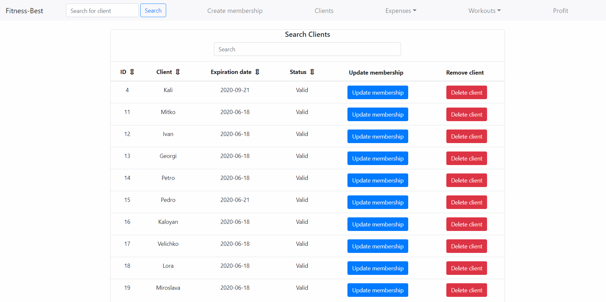
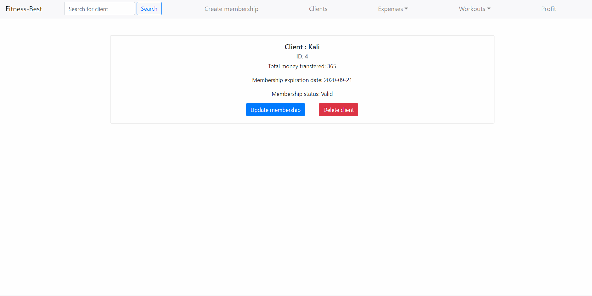
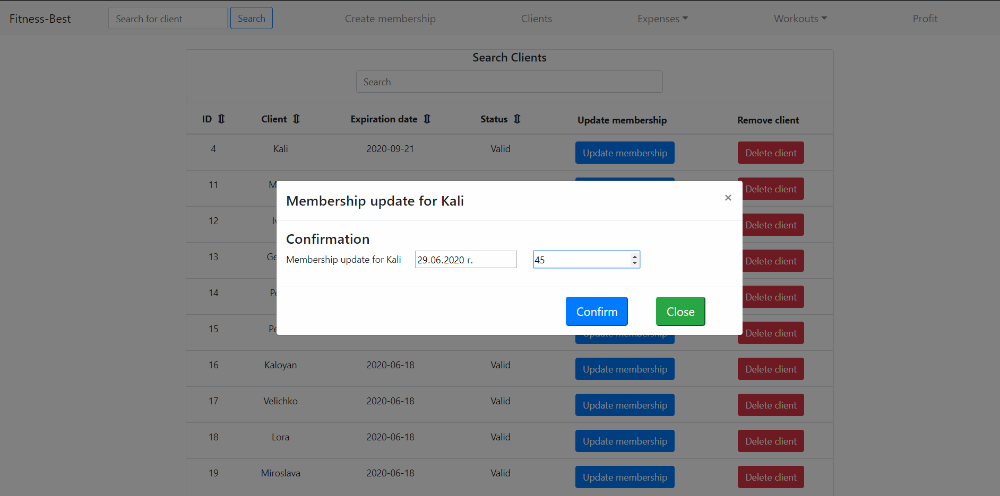
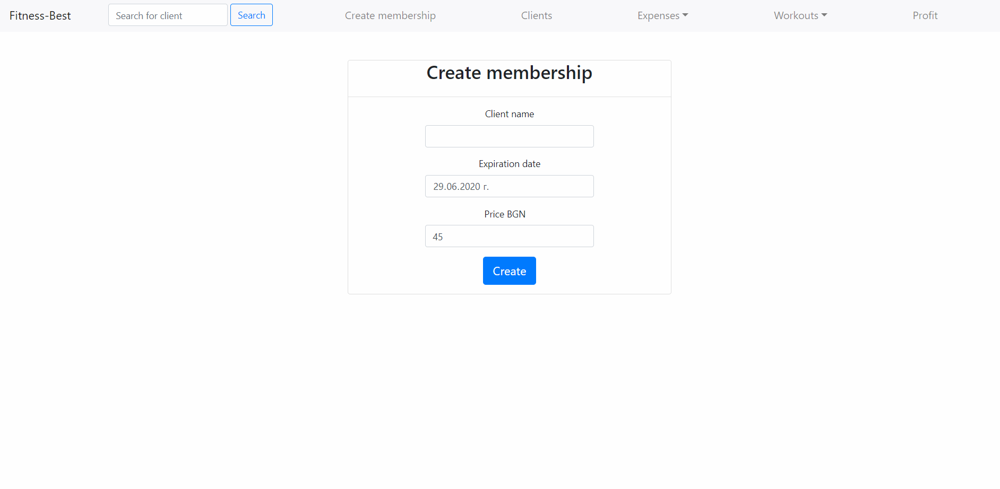
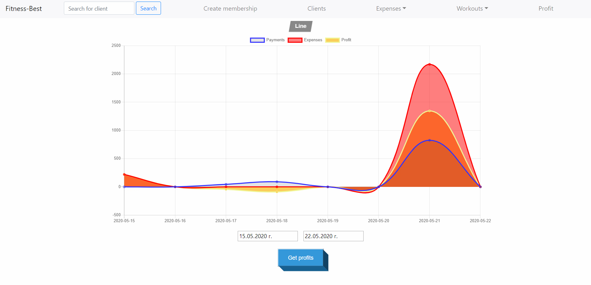
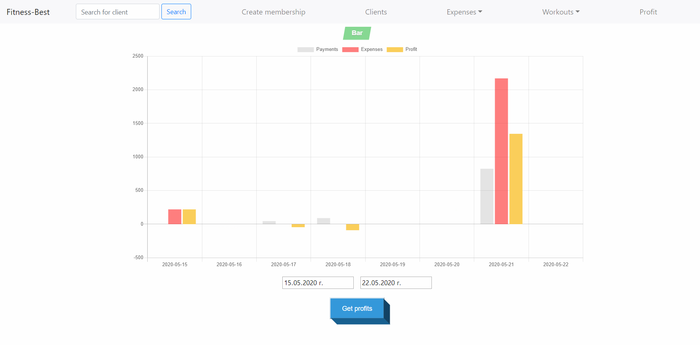
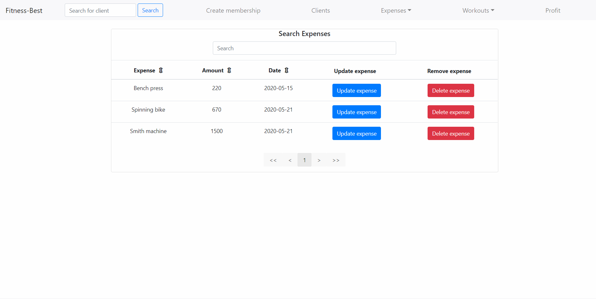
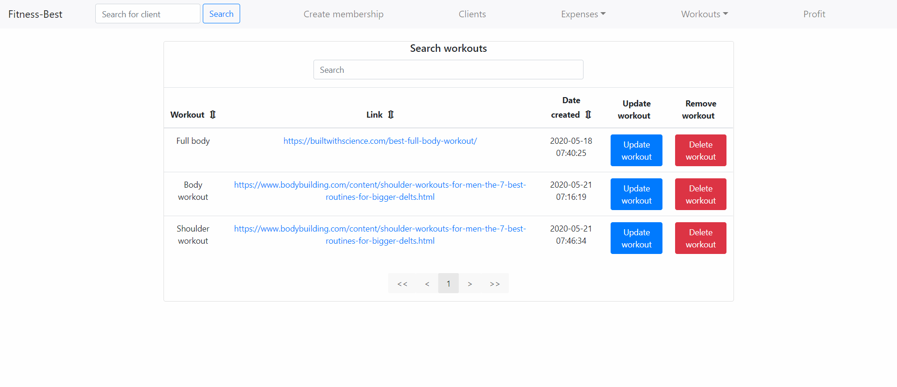

# fitness-system
Laravel &amp; React project

## Fitness management system

### Start back-end server -> (1) cd back-end, (2) php artisan migrate ,(3) php artisan serve
### Start front-end server -> (1) cd front-end, (2) npm start

### Clients menu

### Profits menu

### Expenses menu

### Workouts menu

